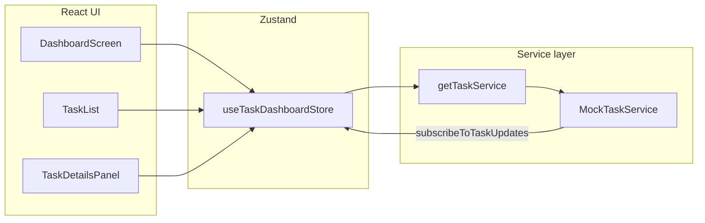

# AI DevOps Dashboard — Frontend Documentation

**Quick hands-on script:** see [`DEMO.md`](./DEMO.md) (dummy walkthrough + header “Demo: fail load” button).

**UI shell:** The dashboard uses a **Paytm-inspired** light layout (navy `#002E7E`, cyan `#00BAF2`, page `#F5F7F9`, white cards). The wordmark is `public/paytm-logo.png` (replace the file to swap branding).

This document explains how the React app is structured, how data flows from the (mock) task API into the UI, and how you can replace the mock with a real JRA-MCP-Server backend later.

---

## 1. What this app does

- Shows a **list of jobs/tasks** (left column).
- Shows **details** for the selected job: pipeline steps, progress, logs, PR area, deployment line (right column).
- **Simulates** backend behavior: tasks move through `pending` → `running` → `completed` or `failed`, progress increases, logs grow.
- The **API shape** is fixed in TypeScript (`Task`, `TaskAPI`) so the UI does not depend on mock internals.

---

## 2. Tech stack

| Piece | Role |
|--------|------|
| **Vite** | Dev server, bundling, HMR |
| **React 19** | UI with function components |
| **TypeScript** | Types for tasks and API contract |
| **Tailwind CSS v4** (`@tailwindcss/vite`) | Utility styling |
| **Zustand** (`createWithEqualityFn` from `zustand/traditional`) | Global dashboard state |
| **`use-sync-external-store`** | **Required dependency** for `zustand/traditional` (install explicitly; npm does not always hoist it) |

Commands:

```bash
cd frontend
npm install
npm run dev      # http://localhost:5173
npm run build
npm run lint
```

---

## 3. Step-by-step: from browser load to pixels

### Step 1 — `index.html`

The page loads a single root node and the entry script:

```html
<div id="root"></div>
<script type="module" src="/src/main.tsx"></script>
```

### Step 2 — `src/main.tsx`

1. Imports global styles (`index.css`, including Tailwind).
2. Finds `#root`; throws if missing (fail fast).
3. Creates a React root and renders:
   - **`ErrorBoundary`** — catches render errors and shows a simple fallback instead of a blank page.
   - **`App`** — currently only mounts the dashboard screen.

### Step 3 — `src/App.tsx`

Renders **`DashboardScreen`** and nothing else (entry point for this feature).

### Step 4 — `src/screens/DashboardScreen.tsx`

This is the **page layout**:

1. **Subscribes** to the Zustand store (loading, errors, selected task id, task map, init flag).
2. **`useEffect`** runs once (per stable `initialize` reference) and calls **`initialize()`**:
   - Loads tasks from the service.
   - Registers **`subscribeToTaskUpdates`** so later mock (or WebSocket) pushes merge into the store.
3. **Computes** `selectedTask` from `selectedTaskId` + `tasksById`.
4. **Renders**:
   - Header (title, Job History / Settings / Help).
   - Optional **error banner** when `error` is set.
   - **`main`**: left **`TaskList`**, right **`TaskDetailsPanel`** (or a loading placeholder until `initialized`).

### Step 5 — `src/services/taskService.ts` (composition root)

- **`getTaskService()`** returns a singleton implementing **`TaskAPI`** (today: `MockTaskService`).
- **`retryFailedTask(id)`** and **`setFailNextTaskListFetch(...)`** are extra helpers used by the store/UI until the real API exposes the same behavior on `TaskAPI`.

**This is the main swap point for a real backend:** change what `getTaskService()` returns (HTTP client, WebSocket wrapper, etc.) as long as it implements `TaskAPI`.

### Step 6 — `src/hooks/useTaskDashboardStore.ts` (state + actions)

The store holds:

| Field | Meaning |
|--------|---------|
| `tasksById` | Map `id → Task` |
| `taskOrder` | Ordered list of ids (newest activity first after sort) |
| `selectedTaskId` | Which card is active |
| `filter` | `all` \| `running` \| `completed` |
| `search` | Free-text filter on id/name |
| `loading` / `creating` / `error` | UX flags |
| `initialized` | First successful `getTasks` completed |
| `subscriptionStarted` | `subscribeToTaskUpdates` registered once |

Important actions:

- **`initialize`** — guarded so React Strict re-mounts / double calls share one `pendingInit` promise; loads tasks; wires subscription; sets `initialized`.
- **`upsertTask`** — merges one task into `tasksById` and re-sorts `taskOrder` by `updatedAt`.
- **`refreshTasks`**, **`createTask`**, **`retryTask`**, **`simulateListError`** — call service + update state.

**Why `createWithEqualityFn` + `shallow`?**  
React 19’s `useSyncExternalStore` is sensitive to selector identity and referential churn. Zustand’s “traditional” store uses `use-sync-external-store/with-selector` and shallow equality so selecting slices (objects, arrays) does not cause infinite re-renders.

### Step 7 — `src/components/TaskList.tsx`

1. Reads **`taskOrder`**, **`tasksById`**, **`filter`**, **`search`** from the store (separate selectors; stable for Zustand).
2. Uses **`useMemo`** + **`selectVisibleTasks(...)`** to derive the visible list (filter + search). This avoids returning a new array from a single Zustand selector on every tick.
3. Renders filter chips, search input, “create task” input, and **`TaskCard`** rows.

### Step 8 — `src/components/TaskDetailsPanel.tsx`

1. If **no task selected** → empty state (no log hook).
2. If **task selected** → **`TaskDetailsBody`**:
   - **`useTaskLogs(task)`** polls **`getTaskLogs(task.id)`** on an interval while the task is “active” (`pending` / `running` / `failed`).
   - Renders pipeline copy from **`src/lib/pipeline.ts`** (labels + “Step X of N” from `progress` + `status`), **`ProgressBar`**, **`LogsViewer`**, PR block, deployment line, optional **Retry**.

### Step 9 — `src/mocks/mockTaskService.ts`

Implements **`TaskAPI`** plus **`retryFailedTask`** (used only through `taskService.ts`):

- Seeds a few tasks on construction.
- **`getTasks` / `getTaskById` / `getTaskLogs`** — async with small delays.
- **`createTask`** — inserts `pending` task, then after a timeout moves to `running` and starts a **`setInterval`** “simulation”.
- **`patchTask`** — updates task + **`notify`** listeners.
- **`subscribeToTaskUpdates(callback)`** — adds listener; today mimics what you’d later do when a WebSocket message arrives (call `callback(updatedTask)`).

---

## 4. Folder map

```
frontend/
├── DOCS.md                 ← this file
├── index.html
├── vite.config.ts          ← React + Tailwind plugins
├── package.json
└── src/
    ├── main.tsx            ← React bootstrap + ErrorBoundary
    ├── App.tsx             ← Routes to DashboardScreen
    ├── index.css           ← Tailwind import + base body styles
    ├── types/
    │   ├── task.ts         ← Task, TaskStatus
    │   ├── taskApi.ts      ← TaskAPI interface
    │   └── index.ts        ← re-exports
    ├── services/
    │   └── taskService.ts  ← getTaskService(), retry helpers
    ├── mocks/
    │   └── mockTaskService.ts
    ├── hooks/
    │   ├── useTaskDashboardStore.ts
    │   └── useTaskLogs.ts
    ├── lib/
    │   └── pipeline.ts     ← UI-only pipeline labels
    ├── screens/
    │   └── DashboardScreen.tsx
    └── components/
        ├── ErrorBoundary.tsx
        ├── TaskList.tsx
        ├── TaskCard.tsx
        ├── TaskDetailsPanel.tsx
        ├── LogsViewer.tsx
        ├── ProgressBar.tsx
        └── StatusBadge.tsx
```

---

## 5. API contract (for your future backend)

Defined in **`src/types/taskApi.ts`**:

| Method | Purpose |
|--------|---------|
| `getTasks()` | Initial list + refresh |
| `getTaskById(id)` | Single task (ready for a detail endpoint) |
| `createTask({ name })` | Start a new job |
| `getTaskLogs(id)` | String lines (today polled; later could be SSE/WebSocket) |
| `subscribeToTaskUpdates(cb)` | Push **`Task`** updates when anything changes |

**`Task`** (`src/types/task.ts`): `id`, `name`, `status`, `progress` (0–100), `createdAt`, `updatedAt` (ISO strings).

---

## 6. Data flow (high level)



1. UI calls store actions (`initialize`, `createTask`, …).
2. Store calls **`getTaskService()`** methods.
3. Mock (or future client) updates tasks and calls **subscribers** → store **`upsertTask`** → UI re-renders.

---

## 7. Replacing the mock with a real JRA-MCP-Server

1. **Implement `TaskAPI`** in a new class (e.g. `HttpTaskService`) using `fetch` or your HTTP client.
2. In **`src/services/taskService.ts`**, return that instance from **`getTaskService()`** instead of `MockTaskService`.
3. **`subscribeToTaskUpdates`**: open a WebSocket (or SSE); on each message, parse a `Task` and invoke the same `callback` the mock uses today.
4. **`getTaskLogs`**: either keep polling or switch to a streaming endpoint and buffer lines in the client (you may extend the contract later if needed).
5. Move **`retryFailedTask`** into the real API module once the server supports it, and keep exporting it from `taskService.ts` for minimal UI changes.

---

## 8. Troubleshooting

| Symptom | Likely cause |
|---------|----------------|
| Blank dark page, no UI | Missing **`use-sync-external-store`** — run `npm install` in `frontend` and restart dev server. |
| “Maximum update depth” / flicker | Selector returning new objects/arrays every time without equality; here mitigated by `createWithEqualityFn` + `shallow` and `useMemo` in `TaskList`. |
| Logs not updating | `useTaskLogs` only polls while status is `pending` / `running` / `failed`; completed tasks get one final pull. |

---

## 9. Quick reading order (for new developers)

1. `src/types/task.ts` + `taskApi.ts` — data contract  
2. `src/services/taskService.ts` — where to plug the backend  
3. `src/mocks/mockTaskService.ts` — expected behavior of the contract  
4. `src/hooks/useTaskDashboardStore.ts` — how the UI talks to the service  
5. `src/screens/DashboardScreen.tsx` — page wiring  
6. `src/components/TaskList.tsx` + `TaskDetailsPanel.tsx` — presentation  

If you want this split into shorter pages (e.g. `docs/API.md`, `docs/STATE.md`), say how you prefer it organized and we can mirror that structure.
